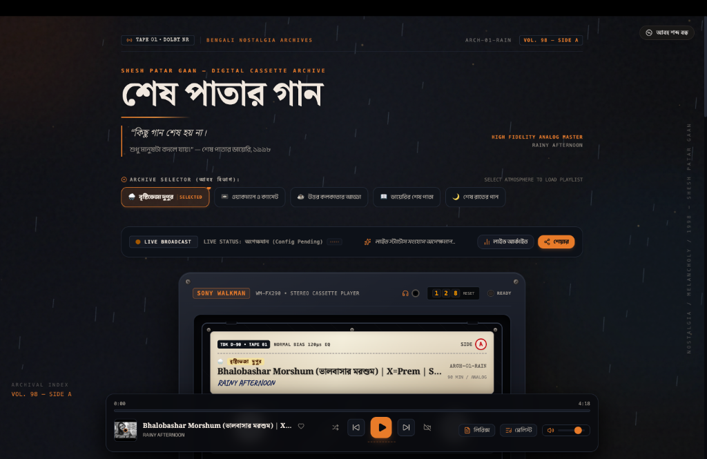
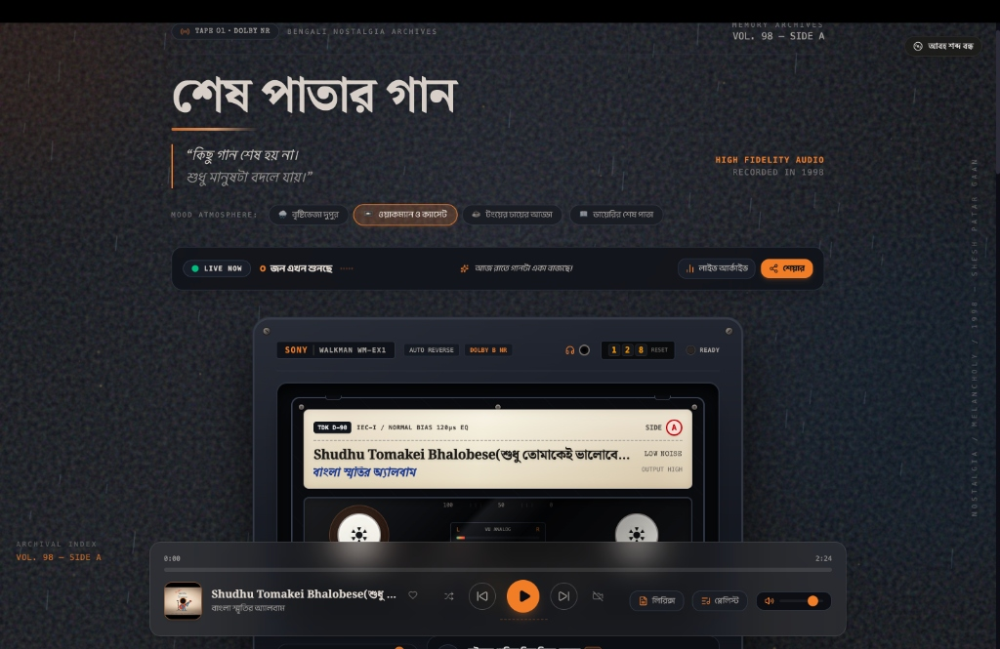
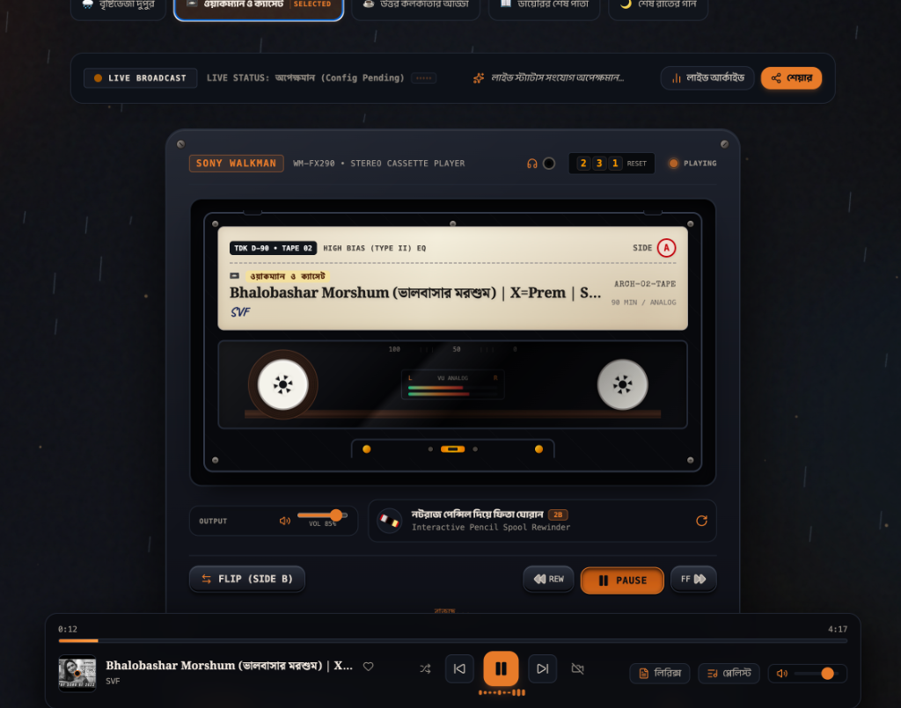
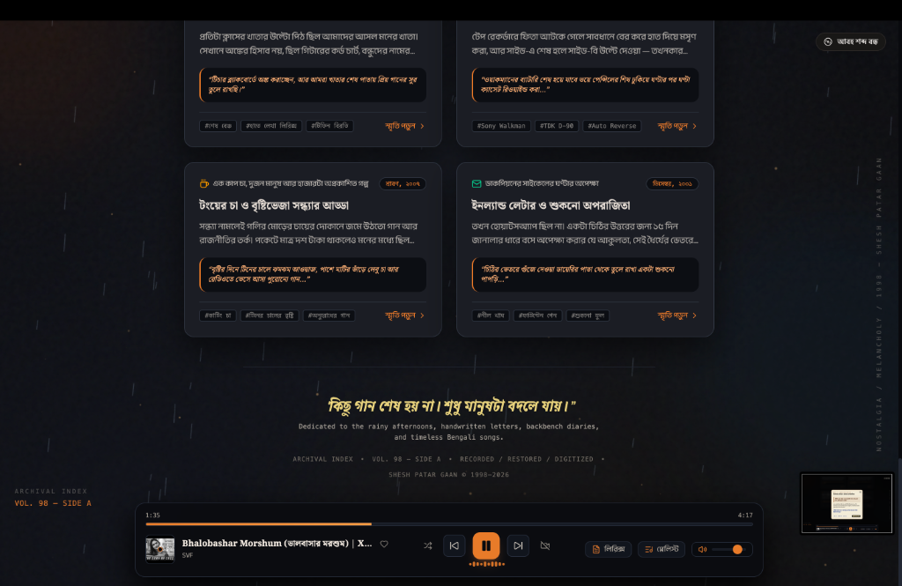
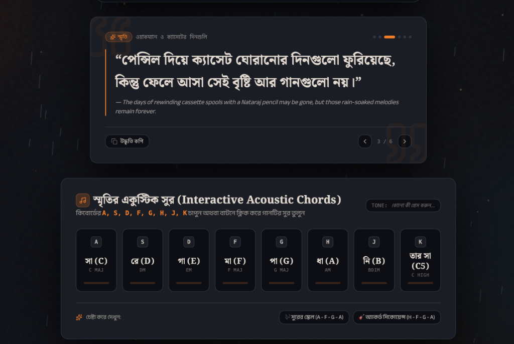

# 🎵 শেষ পাতার গান — Shesh Patar Gaan

> *A digital Bengali nostalgia archive built around forgotten songs, cassette culture, Kolkata memories, and late-night listening.*

---

## 🌐 Live Demo

### 🔗 [Visit Shesh Patar Gaan Live Experience](https://shesh-patar-gaan.vercel.app/)

---

## 📸 Screenshots / Preview

### 🌧️ Rain Archive Atmosphere

*Rainy Afternoon (বৃষ্টিভেজা দুপুর) mood atmosphere with initial Walkman player deck & catalog markings.*

### 📼 Walkman & Cassette Player View

*Walkman & Cassettes (ওয়াকম্যান ও ক্যাসেট) mood selected with TDK D-90 cassette label and player controls.*

### 📻 High-Fidelity Sony Walkman Deck

*Detailed view of the Sony Walkman WM-FX290 stereo cassette deck with animated spools, VU meter, and side-flip controls.*

### 📖 Nostalgic Memory Wall & Archives

*Grid of classic Bengali nostalgia memories including school notebook backbenches, roadside tea stall chats, and handwritten inland letters.*

### 🎹 Interactive Bengali Acoustic Chords Synthesizer

*Interactive Swara Synthesizer allowing listeners to play Bengali acoustic notes (সা, রে, গা, মা, পা, ধা, নি) directly via keyboard keys.*

---

## 🎞️ What is Shesh Patar Gaan?

**শেষ পাতার গান (Shesh Patar Gaan)** is a web experience crafted to preserve and celebrate Bengali musical nostalgia. Inspired by 90s cassette culture, roadside tea stall chats (*টংয়ের চায়ের আড্ডা*), monsoon afternoons, requested radio shows, and handwritten diary scribbles on backbenches, the platform connects listeners to iconic melodies through a vintage analog interface.

Rather than acting as a standard music player, **Shesh Patar Gaan** serves as a digital archive where each playlist represents a distinct mood, era, and personal memory.

---

## 🎧 Archive Experience

The application features five distinct nostalgia archives:

| Icon | Bengali Title | English Title | Atmosphere & Subtitle | Catalog Code |
| :---: | :--- | :--- | :--- | :--- |
| 🌧️ | **বৃষ্টিভেজা দুপুর** | RAINY AFTERNOON | শ্রাবণের মেঘ ও ঝুম বৃষ্টি | `ARCH-01-RAIN` |
| 📼 | **ওয়াকম্যান ও ক্যাসেট** | WALKMAN & CASSETTES | টিডিকে ৯০ মিনিটের ক্যাসেট | `ARCH-02-TAPE` |
| ☕ | **উত্তর কলকাতার আড্ডা** | NORTH KOLKATA ADDA | টংয়ের চা ও পুরনো গিটার | `ARCH-03-ADDA` |
| 📖 | **ডায়েরির শেষ পাতা** | THE LAST PAGE | ব্যাকবেঞ্চের কাটাকাটি চিহ্ন | `ARCH-04-PAGE` |
| 🌙 | **শেষ রাতের গান** | SONGS AFTER MIDNIGHT | নিঝুম রাতের নির্জন সুর | `ARCH-05-NIGHT` |

Listeners can switch seamlessly between archives using the top **Archive Selector** tab bar.

---

## 🎵 Music Experience

The audio system is powered by a hidden YouTube IFrame API integration:

- **Seamless Archive Switching**: Dynamically loads real YouTube playlists when selecting an atmosphere.
- **Full Transport Controls**: Play, pause, skip forward, skip backward, and seek using the timeline scrubber.
- **Interactive Playlist Drawer**: Popup drawer listing all tracks in the active playlist with real-time active track highlighting.
- **Track & Artist Metadata**: Live track title, channel/artist name, duration, and progress percentage.
- **Volume & Mute Controls**: Master volume slider with mute/unmute toggles.
- **Real-Time Visualizer**: Animated audio wave indicator reflecting active playback states.

---

## 📼 Cassette / Analog Interface

The visual centerpiece is a Walkman cassette player deck:

- **Authentic Cassette Aesthetics**: Stamped tape numbers (`TAPE 01`–`05`), tape side markers (`SIDE A` / `SIDE B`), and magnetic tape bias specifications (`NORMAL BIAS`, `HIGH BIAS TYPE II`, `FERRO CHROME`, `METAL BIAS`).
- **Animated Tape Spools**: Dual counter-rotating reels that spin dynamically during playback and speed up during fast-forward/rewind actions.
- **Realistic Audio Feedback**: Web Audio API-synthesized mechanical clicks on deck button presses and tape ejects.
- **Smoked Acrylic Window**: Layered worn glass texture with molded screw details.

---

## ✨ Features

- 🎼 **Curated Bengali Nostalgia Archives**: Five distinct atmosphere categories.
- 📼 **Walkman-Inspired Interface**: Analog cassette deck with animated spools and physical button sounds.
- 🎧 **YouTube-Powered Audio**: Native YouTube IFrame API integration for seamless streaming.
- 🗂️ **Interactive Playlist Drawer**: View track counts and browse songs within the active archive.
- 📻 **Live Listener Broadcast**: Real-time online listener presence powered by Firebase Realtime Database.
- 🎹 **Interactive Acoustic Synth**: Play Bengali notes (*সা, রে, গা, মা, পা, ধা, নি*) via keyboard plucks.
- 📖 **Nostalgic Diary Wall**: Read and share handwritten memory scribbles with custom ink colors.
- 🇧🇩 **Bengali-First Typography**: Curated typography using custom Bengali serif and handwriting fonts.
- 📱 **Fully Responsive**: Optimized for desktop, tablet, and mobile browsers.

---

## 🛠️ Tech Stack

- **Frontend Framework**: React 19
- **Language**: TypeScript
- **Build Tool**: Vite
- **Styling**: Vanilla CSS + Tailwind CSS v4
- **Icons**: Lucide React
- **Audio Engine**: YouTube IFrame API + Web Audio API (`AudioContext`)
- **Realtime Database**: Firebase Realtime Database (for presence & stats)
- **Deployment**: Vercel

---

## 🏗️ Project Structure

```
shesh-patar-gaan/
├── src/
│   ├── components/
│   │   ├── HeaderTitle.tsx             # Archival identity & mood tab selector
│   │   ├── WalkmanCassette.tsx         # Vintage Walkman cassette deck centerpiece
│   │   ├── GlassMusicPlayer.tsx        # Fixed bottom playback deck & playlist drawer
│   │   ├── LiveStationBar.tsx          # Real-time listener count broadcast bar
│   │   ├── DiaryLastPage.tsx           # Interactive notebook memory wall
│   │   ├── MemoriesGrid.tsx            # Historical nostalgia memory cards & modal
│   │   ├── InteractiveKeyboardChords.tsx # Acoustic Bengali note synthesizer
│   │   ├── BackgroundAmbience.tsx      # Dynamic background particle ambience
│   │   ├── RotatingQuotes.tsx          # Rotating nostalgic Bengali poetry quotes
│   │   └── WriteMemoryModal.tsx        # Modal for writing new scribbles
│   ├── context/
│   │   ├── YouTubeMusicContext.tsx     # YouTube IFrame API state & archive switching logic
│   │   └── LiveListenerContext.tsx     # Firebase presence & listener count provider
│   ├── data/
│   │   └── nostalgiaData.ts            # Authoritative archive definitions & memory lists
│   ├── services/
│   │   └── firebasePresence.ts         # Firebase Realtime Database integration
│   ├── utils/
│   │   └── audioSynth.ts               # Mechanical cassette click synthesizer
│   ├── types.ts                        # TypeScript interfaces & types
│   ├── App.tsx                         # Main application layout
│   ├── main.tsx                        # Application root entry point
│   └── index.css                       # Custom retro styles & font imports
├── public/                             # Static public assets
├── package.json                        # Node.js dependencies & scripts
├── vite.config.ts                      # Vite build configuration
└── README.md                           # Documentation
```

---

## 🚀 Run Locally

### Prerequisites

- Node.js (v18 or higher recommended)
- npm or yarn

### Installation Steps

1. **Clone the repository**:
   ```bash
   git clone https://github.com/Armantech10/-shesh-patar-gaan.git
   cd -shesh-patar-gaan
   ```

2. **Install dependencies**:
   ```bash
   npm install
   ```

3. **Configure Environment Variables** (Optional, for Firebase presence):
   Create a `.env` file in the root directory based on `.env.example`:
   ```bash
   cp .env.example .env
   ```

4. **Start the development server**:
   ```bash
   npm run dev
   ```
   Open your browser at `http://localhost:3000/`.

---

## 🔐 Environment Variables

To enable real-time live listener counts and playback statistics via Firebase, configure the following keys in your `.env` file:

```env
VITE_FIREBASE_API_KEY=your_firebase_api_key
VITE_FIREBASE_AUTH_DOMAIN=your_project_id.firebaseapp.com
VITE_FIREBASE_DATABASE_URL=https://your_project_id-default-rtdb.firebaseio.com
VITE_FIREBASE_PROJECT_ID=your_project_id
VITE_FIREBASE_STORAGE_BUCKET=your_project_id.appspot.com
VITE_FIREBASE_MESSAGING_SENDER_ID=your_messaging_sender_id
VITE_FIREBASE_APP_ID=your_app_id
```

*Note: The app will run smoothly even without Firebase credentials using fallback local stats.*

---

## 📚 Playlist Archives (Source of Truth)

The five archives map to these exact YouTube playlist IDs configured in `src/data/nostalgiaData.ts`:

| Archive Name | Archive ID | YouTube Playlist ID |
| :--- | :---: | :---: |
| 🌧️ **বৃষ্টিভেজা দুপুর** | `rain` | `PLHKSA52iDlco` |
| 📼 **ওয়াকম্যান ও ক্যাসেট** | `cassette` | `PLEXYnou60qCI` |
| ☕ **উত্তর কলকাতার আড্ডা** | `adda` | `PLKq15KUfR14w` |
| 📖 **ডায়েরির শেষ পাতা** | `diary` | `PLV1aJ7LX8U28` |
| 🌙 **শেষ রাতের গান** | `night` | `PLA0UV4MO19MA` |

---

## 🎨 Design Philosophy

- **Bengali Cultural Nostalgia**: Grounded in classic Bengali literature, requested radio shows, and vintage cassette culture.
- **Archival Catalog Aesthetic**: Visual design modeled after vinyl catalog cards, Dolby tape markings, and typewriter typography.
- **Cinematic Warmth**: Deep dark slate palette (`#0A0C10`) paired with warm amber lighting (`#E87B28`) and subtle film grain overlay.
- **Tactile Audio Feedback**: Mechanical deck clicks ground digital interactions in physical audio nostalgia.

---

## 🌐 Deployment

The application is deployed on Vercel:

- **Live URL**: [https://shesh-patar-gaan.vercel.app/](https://shesh-patar-gaan.vercel.app/)

---

## 👨‍💻 Author

**Arman** ([@Armantech10](https://github.com/Armantech10))

---

## 📄 License

*No license has currently been specified for this project.*
